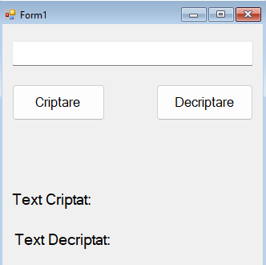

Playfair Cipher
===============

#### Overview

The Playfair Cipher is a Windows Forms application that implements the Playfair cipher, a manual symmetric encryption technique. It allows users to encrypt and decrypt text using a custom 5x5 alphabet matrix generated from a provided key.

## Features

* Encrypts and decrypts text using the Playfair cipher algorithm.
* Uses a customizable key to generate a 5x5 alphabet matrix, excluding 'J' and replacing it with 'I'.
* Automatically handles text preparation (e.g., pairing letters, adding 'X' for padding).
* Displays both encrypted and decrypted text in real-time.

Screenshots
-----------

 

Installation
------------

1. Ensure a compatible .NET environment is installed on your system.
2. Compile the provided code using a suitable IDE (e.g., Visual Studio).
3. Run the compiled executable.

Usage
-----

1. Launch the application.
2. Enter the text to encrypt in the text box.
3. Click the "Criptare" (Encrypt) button to encrypt the text.
4. The encrypted text will appear under "Text Criptat".
5. Click the "Decriptare" (Decrypt) button to decrypt the text.
6. The decrypted text will appear under "Text Decriptat".

Notes
-----

* The default key is "CONTRACTDEDONATIEBILATERALAASOCIETATIIPEACTIUNI", but the algorithm supports any key.
* The application replaces 'J' with 'I' and adds 'X' as padding when necessary.
* The Playfair cipher uses a 5x5 grid, with encryption and decryption following specific rules for same-row, same-column, and rectangle cases.
